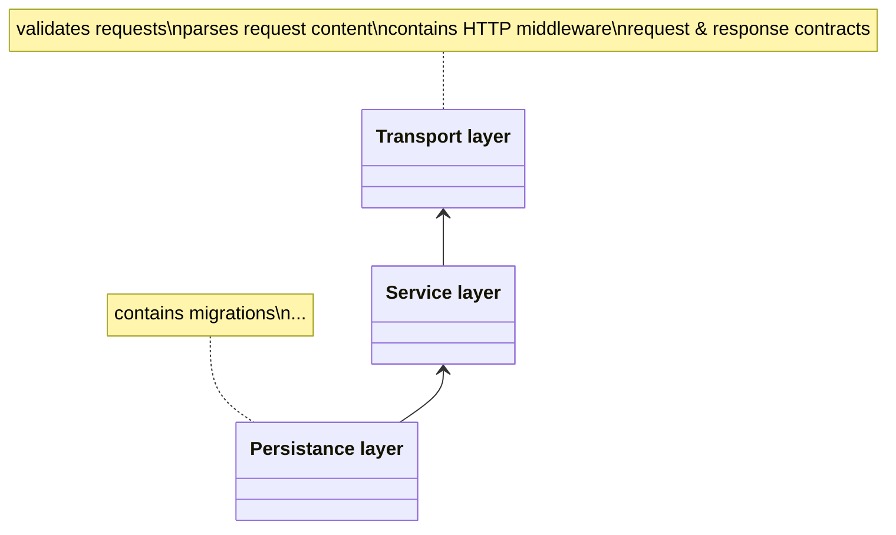
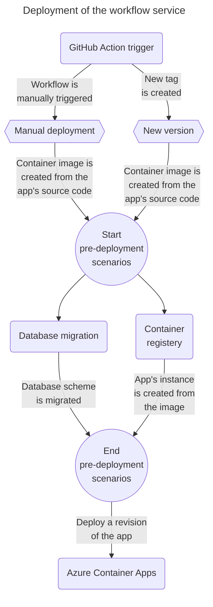

    

# Recognition service
A repository with a service for executing recognition of documents. This repository is part of [Microservices Reference Framework](https://github.com/MichalMoudry/microservice-reference-framework "Link to Microservice Reference Framework repository").

## Project structure
- **/src** - A folder with the source code and tests for this service.
    - **main.py** - The entry point for the service.
    - **/transport** - A module containing a transport layer of this service. Transport layer contains stuff like:
        - Classes (Data Transfer Objects) that are used as models for HTTP requests and responses.
        - Additional validation methods.
        - Package for helping with REST API metadata.
    - **/service** - A module representing a service layer. Service layer contains all the business logic of this service. So, this module contains things like:
        - Classes that run OCR on the uploaded images.
        - Packages that help with the processing of uploaded image/files.
        - Package that enables sending of messages in the entire system.
    - **/database** - A module representing a database layer of this service. This module contains elements like:
        - Model classes for the SQLAlchemy ORM (Object Relational Mapper) system.
        - Database migrations which are used by Alembic to properly version the database scheme.
    - **/tests** - A folder with test assets and API tests for this project. This includes:
        - **/test_images** - A folder with images that are used for the purpose of testing recognition and file upload.
        - **/api** - A folder with integration tests of this service. Tests cover things like:
            - Correct API responses.
- **/.github/workflows** - Is a folder with YAML files containing definitions for GitHub Actions pipelines.

## Service architecture
For architecture overview of the entire system, visit: [Microservice Reference Framework Repository](https://github.com/MichalMoudry/microservice-reference-framework "Link to Microservice Reference Framework repository").

Architecture of this specific service is described in the diagram below.

**Diagram catalog**:
- Transport
- Service
- Database

## Getting started
This section contains ways to get started (running, deploying, ...) with this service.
### Local deployment
For running this app locally, you need to have the following:

| Requirement                       | Version | Addditional info                                                       |
|-----------------------------------|---------|------------------------------------------------------------------------|
| Python                            | >=3.10  |                                                                        |
| Installed all the dependencies    | -       | This means having installed all the libraries in requirements.txt file |
| Running an instance of PostgreSQL |         |                                                                        |

## Deployment
### Deployment process
This section contains information about analytics service's deployment process and environment.
### Deployment process
This section contains information about workflow service's deployment process and environment.

**Diagram catalog**:
- **GitHub Action trigger** - Starting point of the deployment process is a GitHub action for deploying the workflow service.
This action is triggered manually or when a new version/tag is created.
- **Manual deployment** - An event that represents a manual deployment of the workflow service.
- **New version** - An event representing an automatic deployment of the workflow service.
This event is triggered when a new version/tag has been created.
- **Container registry** - A registry for storing container images.
    - Examples: Docker hub or Azure Container Registry.
- **Azure Container Apps** - A cloud environment where this service is being hosted/deployed.
This environment has Dapr as a serverless service.
- **Database migration** - There is a mechanism for migrating database scheme to a new version.
### Deployment diagram

## Used libraries
- Quart - Is a framework for creating web APIs.
- [pytesseract](https://github.com/madmaze/pytesseract "Link to the pytesseract GitHub repository") - Is a library for enabling use of OCR in Python apps. It is a wrapper for Tesseract OCR.
- [pytest](https://github.com/pytest-dev/pytest/ "Link to the pytest GitHub repository") - A testing framework for writing functional tests.
- [SQLAlchemy](https://github.com/sqlalchemy/sqlalchemy "Link to the SQLAlchemy GitHub repository") - A Python SQL toolkit and ORM (Object Relational Mapper) system.
- [dapr](https://github.com/dapr/dapr "Link to the dapr GitHub repository") - Is a library that integrates this service with _dapr_ (or Distributed Application Runtime). This runtime is used for building systems based on microservice architecture.
- [Pydantic](https://github.com/pydantic/pydantic "A link to Pydantic GitHub repository") - A Python library for data validation.

More information can be found in the [pyproject.toml](./pyproject.toml "Link to pyproject.toml file") file.
